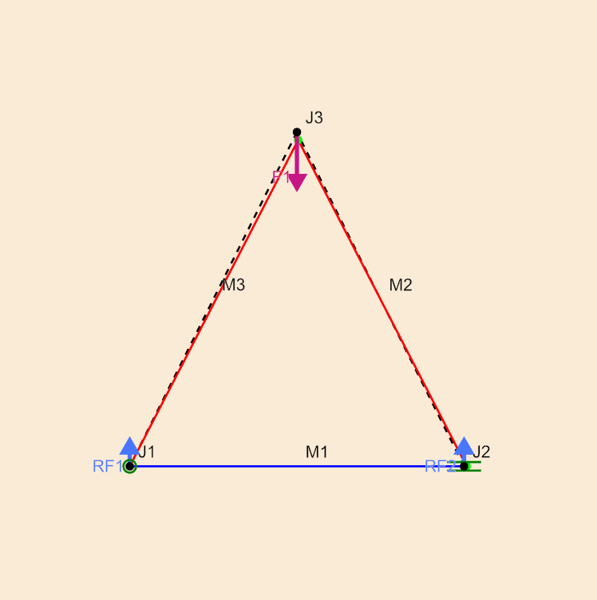

# SimpleStatics

<!-- [](https://Boxylmer.github.io/SimpleStatics.jl/stable/) -->
[](https://Boxylmer.github.io/SimpleStatics.jl/dev/)
[](https://github.com/Boxylmer/SimpleStatics.jl/actions/workflows/CI.yml?query=branch%3Amaster)
[](https://codecov.io/gh/Boxylmer/SimpleStatics.jl)


SimpleStatics is a package that assists in the computation and visualization of 2D structure stresses and strains. It's implemented in pure Julia and the content is taken from [**Matrix Analysis of Structures**](https://repository.bakrie.ac.id/10/1/%5BTSI-LIB-131%5D%5BAslam_Kassimali%5D_Matrix_Analysis_of_Structure.pdf) by Kassimali.


# Target Audience
This package is for people wanting to do quick and ***simple*** statics simulations for projects that sit in that awkward middle ground where
- True FEM software packages are overkill
- Working it out on paper is too complicated to do in a few minutes

Think: *I am building a hobby project, but I want to evaluate how much I'll get out of using 3/4" steel tubing over 1/2" tubing, or using a support member **here** rather than **there**.* 

It goes without saying (see the **LICENSE**) but **for the love of all that is good, please do not use this for commercial projects or projects where your life or anyone else's depends on the integrity of the structure.**

Finally, for those of you wanting to use this to check your *statics* homework, you'll get very close answers, but this program accounts for *stress related deformation*, which undergrad classes don't typically ask you to do. To get as close as possible, use `Materials.PerfectMaterial()` for your members. 


# Motivation
I'm using this package to build trusses for chicken and duck cages. Once, they're build, I'll be posting pictures here!


# Quick Start
The closest thing to a *hello world* for this library is a triangle structure.

```Julia
using SimpleStatics
my_setup = StaticSetup() # new blank setup
material = Materials.PVC(0.005) # pvc material with a 0.005 square meter cross section

# Joints are nodes in 2D space, which can be constrained or freely move
j1 = add_joint!(my_setup, 0, 0, AnchorConstraint())
j2 = add_joint!(my_setup, 1, 0, XRollerConstraint())
j3 = add_joint!(my_setup, 0.5, 1)

# Members are beams of material that connect joints and resist force 
add_member!(my_setup, j1, j2, material)
add_member!(my_setup, j2, j3, material)
add_member!(my_setup, j3, j1, material)

# Forces act on joints
add_force!(my_setup, j3, 0, -1000) 

displacements = solve_displacements(my_setup) # how much did each joint move due to the forces?
forces = solve_member_forces(my_setup, displacements) # what were the forces on the members?
reactions = solve_reaction_forces(my_setup, displacements) # what forces do the constraints need to keep the structure in place? 
member_stresses = solve_member_stresses(my_setup, forces) # how much stress does each member undergo? 

plot_setup(my_setup; displacements=displacements, member_forces=forces, reactions=reactions)
```



# Questions and Contributing

The scope of this package is pretty minimial, so I don't see much being changed / added to it besides keeping up with its dependencies (really just [Luxor.jl](http://juliagraphics.github.io/Luxor.jl/stable/) currently). But, if for some reason you do want to see some extra functionality included (e.g., from the textbook I implemented this package from) or have a cool feature to pull request, I'd love to see it!

Finally, if you're unsure or have comments / questions about this package, feel free to open an issue or [reach out](mailto:William.Joseph.Box@gmail.com?subject=[SimpleStatics.jl]%20(your%20subject%20here)) to me via email.
